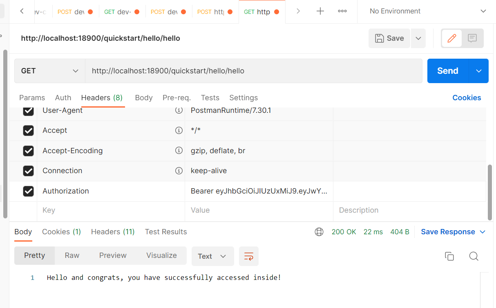
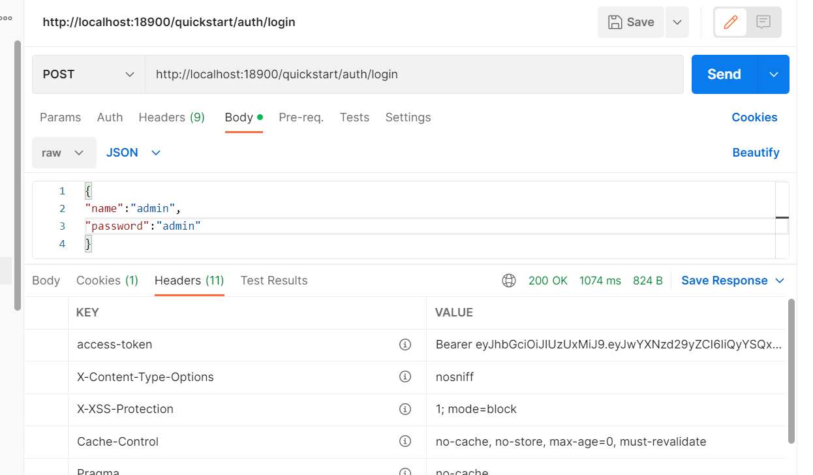
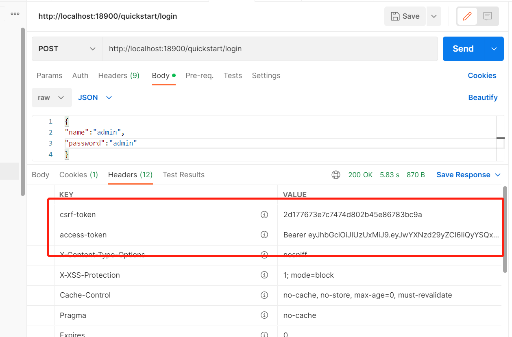
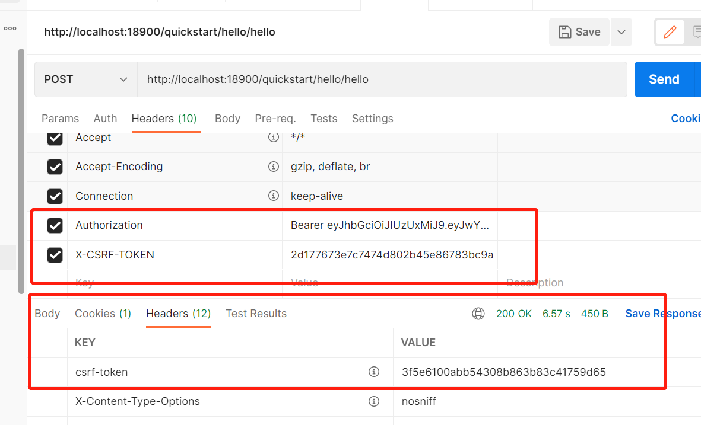

doc

## rookie-security.v.1.0.0

访问方式：

1、http://localhost:18900/quickstart/hello/hello  输入用户名和密码：admin/admin

2、

## rookie-security.v.1.0.1

这个和rookie-security.v.1.0.0测试一样，只是账号和密码存储在数据库中了

## rookie-security.v.1.0.2

## rookie-security.v.1.0.3

